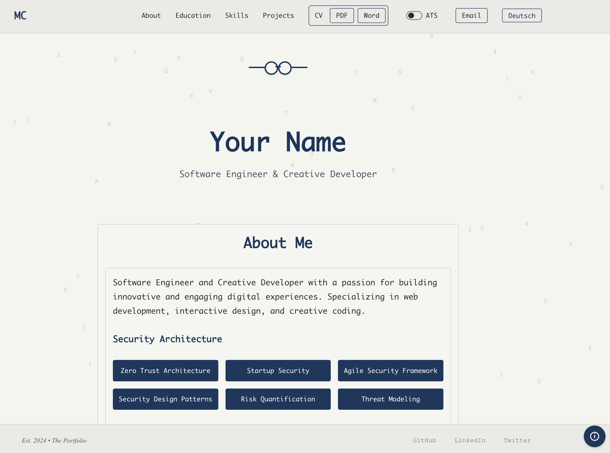

# Portfolio Website

[](https://github.com/norandom/art_app/actions/workflows/deploy.yml)
[](https://opensource.org/licenses/MIT)
[](https://reactjs.org/)
[](https://www.typescriptlang.org/)
[](https://styled-components.com/)

A crafty, responsive and simple portfolio website built with React, TypeScript, and Styled Components. Features a clean design, accessibility and internationalization support.

* Download option for Human Ressource professionals in ATS format.
* Contact option for potential clients.



## ✨ Features

- 🌍 Internationalization (English/German)
- ♿ Accessibility focused 
- 📱 Fully responsive design 
- 🎨 Modern animations with a conservative art style
- 🚀 Optimized performance 
- 📄 CV download options (PDF/DOCX) for your curated and optimized documents
- 🔍 SEO (free self-advertising)
- 🚀 Deployment to GitHub Pages (free hosting)
- 📦 Applicant Tracking System (ATS) support (CVs to help your recruiter / hiring manager)
- 📝 Skill table in an Excel like look
- Git branch support
- and more...


## 🚀 Quick Start

1. **Clone the repository**
   ```bash
   git clone https://github.com/norandom/art_app.git
   cd art_app
   ```

2. **Install dependencies**
   ```bash
   npm install
   ```

3. **Start development server**
   ```bash
   npm start
   ```

4. **Build for production**
   ```bash
   npm run build
   ```

## 🛠️ Technologies

- React 18
- TypeScript
- Styled Components
- Framer Motion
- React Router

## 📦 Project Structure

```
art_app/
├── public/
│   ├── assets/
│   │   └── cv/          # CV documents
│   ├── index.html
│   └── ...
├── src/
│   ├── components/      # React components
│   ├── context/         # React context providers
│   ├── styles/          # Global styles and themes
│   ├── translations/    # i18n translation files
│   └── ...
└── ...
```

## 🔧 Configuration

### Environment Variables

Create a `.env` file in the root directory:

```env
REACT_APP_GA_ID=your-ga-id
```

### Deployment

The site is automatically deployed to GitHub Pages using GitHub Actions. Any push to the main branch will trigger a deployment.

## 📱 Browser Support

- Chrome (latest)
- Firefox (latest)
- Safari (latest)
- Edge (latest)

## 🤝 Contributing

1. Fork the repository
2. Create your feature branch (`git checkout -b feature/amazing-feature`)
3. Commit your changes (`git commit -m 'Add some amazing feature'`)
4. Push to the branch (`git push origin feature/amazing-feature`)
5. Open a Pull Request

## 📝 License

This project is licensed under the MIT License - see the [LICENSE](LICENSE) file for details.

## 👤 Author

Your Name
- Website: [yourwebsite.com](https://yourwebsite.com)
- GitHub: [@yourusername](https://github.com/yourusername)
- LinkedIn: [Your Name](https://linkedin.com/in/yourprofile)
